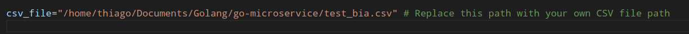
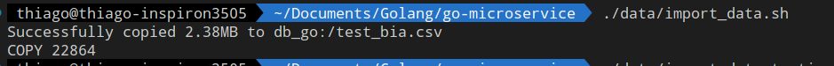
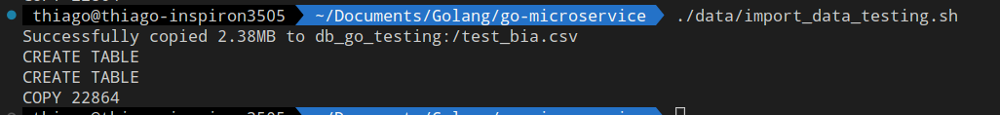
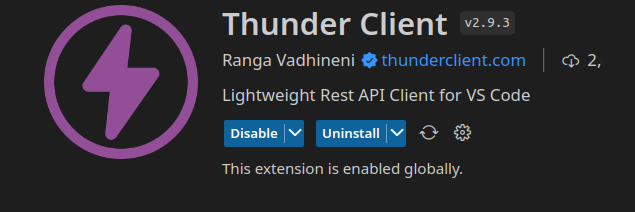
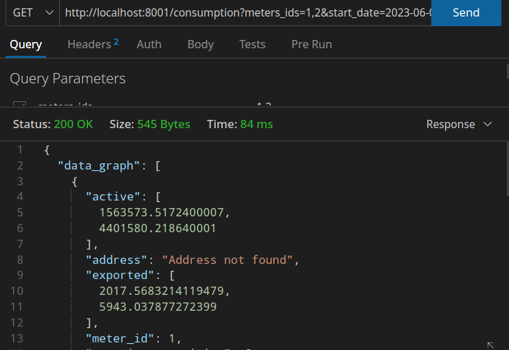
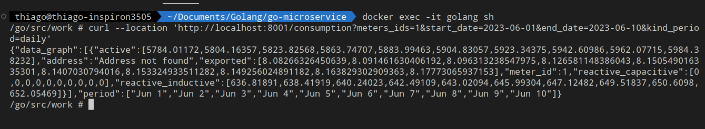

# Go microservice

### requirements:

Se requiere crear un microservicio que esté conectado a una base de datos SQL que tiene una tabla donde se almacenan los consumos de energía de los medidores de nuestros clientes. Este microservicio está integrado por API al microservicio de direcciones el cual almacena las direcciones donde están instalados los medidores.

REQUERIMIENTOS

    1. Crear el microservicio en golang.
    2. Crear una base de datos e importar el csv de ejemplos de consumos.
    3. Se debe crear los siguientes endpoints de consulta con sus respectivos contratos
    4. Implementar test unitarios
    5. Subir el repositorio como privado a github y dar permisos a: sebas-assa y dasuma

OBTENER CONSUMOS MENSUALES
Se debe retornar el consumo acumulado en los meses dados por start_date y end_date

OBTENER CONSUMOS SEMANALMENTE
Se debe retornar los acumulados de cada semana del periodo dado por start_date y end_date.

OBTENER CONSUMOS DIARIOS
Se debe obtener el acumulado de consumo diario

### For this project you should install Docker:

* docker desktop: https://www.docker.com/products/docker-desktop/

* docker engien (for linux): https://docs.docker.com/desktop/install/linux-install/

then of installing Docker you will make the followings steps

* clone this repo

* run docker compose up --build for build all containers, if you have run the projet you can run docker compose up

* open other terminal 
* if you use linux open the file /data/import_data.sh and file ./data/import_data_testing.sh and change the path of csv file for your csv path

in linux you can use the command pwd for see the path

* run this script(if you use linux): ./data/import_data.sh and then run ./data/import_data_testing.sh

* run this script import_data_in_windows.bat if you use windows

The first script fills the main database with the .CSV file data of the requirements

The second script fills the testing database with the .CSV file data of the requirements

## You can try this API as follows:

you can install the next extension for vscode

and you can try with de next url: http://localhost:8001/consumption?meters_ids=1,2&start_date=2023-06-01&end_date=2023-07-10&kind_period=monthly

its some like:

or you can use curl but inside the main container:

* run docker exec  docker exec -it golang sh

then you can try with this url:
curl -X GET "http://localhost:8001/consumption?meters_ids=1,2&start_date=2023-06-01&end_date=2023-07-10&kind_period=
monthly" 

or: 
curl --location 'http://localhost:8001/consumption?meters_ids=1&start_date=2023-06-01&end_date=2023-06-10&kind_period=daily'

